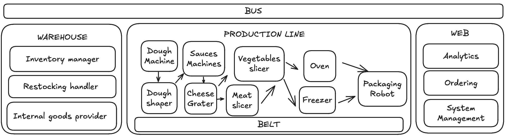
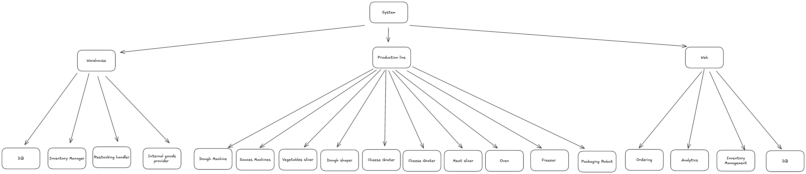

# Pizza I4 (Group 2\)

# Domain Description

Pizza I4 specialises in manufacturing pizzas for supermarkets and individual customers. Our focus is to cover both batch manufacturing and custom ordering of pizzas. The differences between these ordering options are the following:

* **Batch order:**  
  Supermarkets or Distributors can order a batch of pizzas. These pizzas are ordered from a defined menu with no option of customisation.  
* **Custom order:**  
  Customers can either select pizzas from the menu or they can create their own pizza by selecting the ingredients themselves. Custom pizzas are always preferred in the production line over batch pizzas.

## Customer segment

* **B2B (Business to Business):** Supermarkets or distributors  
* **B2C (Business to Customer):** Individual customers

## How do we produce the pizzas?

Our pizzas are produced 24/7 on our production line. This production line consists of a conveyor belt which starts at the dough production stage. From the dough production, the pizza makes its way to the sauce machine and to the different topping machines. Each topping has its own individual machine. Our system ensures that each pizza receives the correct ingredients through a messaging bus.

# Use cases

**Use Case ID:** UC01  
**Use Case Name:** Place Order from Menu  
**Actors:** Customer, Distributor  
**Preconditions:** At least one Pizza is on the menu  
**Steps:**

1. Actor selects pizza(s) and the amount  
2. Systems asks for pizza to be frozen  
3. Actor makes decision  
4. System adds ordered items to basket  
5. Actor finishes order  
6. System processes order

**Postconditions:** An order from the menu has been added to the system  

---

**Use Case ID:** UC02  
**Use Case Name:** Customize and Order Pizza  
**Actors:**  Customer, Distributor  
**Preconditions:** The necessary ingredients are in stock  
**Steps:**

1. Actor selects dough type and shape  
2. Actor selects sauce  
3. Actor selects cheese  
4. Actor selects toppings  
5. Actor selects oven temperature and time  
6. Actor enters amount and confirms order  
7. System adds item(s) to basket  
8. System processes order

**Postconditions:** A custom order has been added to the system

---

**Use Case ID:** UC03  
**Use Case Name:** Process Payment  
**Actors:** Customer, Distributor  
**Preconditions:** An order has been created  
**Steps:**

1. Actor selects payment method  
2. System asks for payment credentials  
3. Actor enters payment credentials  
4. System validates payment  
5. System confirms payment

**Postconditions:** An order has been paid.

---

**Use Case ID:** UC04  
**Use Case:** Prepare Pizza  
**Actors:** Coordinator (Software), Customer  
**Preconditions:** Order is accepted and validated; production line machines are operational.  
**Steps:**

1. Customer submits order (batch or custom).  
2. The coordinator receives orders and publishes a *prepare pizza* event to the message bus.  
3. Machine adapters subscribe to the event and initiate production sequence.

**Postconditions:** Production sequence starts; order is logged in the system.

---

**Use Case ID:** UC05  
**Use Case:** Make Dough  
**Actors:** Dough Mixer Machine (via adapter), Coordinator (Software)  
**Preconditions:** Dough mixer is operational; ingredient inventory is available; *prepare pizza* event is triggered.  
**Steps:**

1. The coordinator publishes a *make dough* event to the message bus.  
2. The dough mixer adapter subscribes to the event and sends commands to the mixer.  
3. The mixer prepares dough based on recipe.  
4. Mixer adapter publishes a *dough ready* event to the message bus.

**Postconditions:** Dough is prepared and ready for shaping; inventory is updated.

---

   
**Use Case ID:** UC06  
**Use Case:** Shape Dough  
**Actors:** Dough Shaping Machine (via adapter), Coordinator (Software)  
**Preconditions:** Dough is prepared; shaping machine is operational; *dough ready* event is received.  
**Steps:**

1. The coordinator publishes a *shape dough* event to the message bus.  
2. The shape machine adapter subscribes to the event and sends commands to the shaper.  
3. Shaper forms dough based on configuration.  
4. Shaper adapter publishes a *dough shaped* event to the message bus.

**Postconditions:** Dough bases are shaped and ready for sauce; process is logged.

---

   
**Use Case ID:** UC07  
**Use Case:** Add Tomato Sauce  
**Actors:** Sauce Applicator Machine (via adapter), Coordinator (Software)  
**Preconditions:** Shaped dough bases are on the conveyor; sauce inventory is available; *dough shaped* event is received.  
**Steps:**

1. The coordinator publishes an *add sauce* event to the message bus.  
2. Sauce applicator adapter subscribes to the event and sends commands to the applicator.  
3. Applicator dispenses sauce based on recipe parameters.  
4. Applicator adapter publishes a *sauce applied* event to the message bus.

**Postconditions:** Sauce is applied to dough bases; ready for toppings; process is logged. 

---

**Use Case ID:** UC08  
**Use Case Name:** Place Pizza in Box  
**Actors:** Packaging Robot  
**Preconditions:** Pizza has completed baking and passed quality inspection.  
**Steps:**

1. The Quality Control System signals pizza is ready for packaging`.`  
2. Packaging Robot retrieves appropriate box size based on pizza dimensions.  
3. The Packaging Robot carefully places pizza into the box.  
4. Packaging Robot seals the box and applies the product label.  
5. The conveyor system moves packaged pizza to the next stage.

**Postconditions:** Pizza is properly packaged and labeled for distribution.

---

   
**Use Case ID:** UC09  
**Use Case Name:** Track Pizza Order  
**Actors:** Order Tracking System, Customer Service Representative  
**Preconditions:** Pizza order has been placed and assigned tracking ID.  
**Steps:**

1. Order Tracking System monitors pizza progress through production stages.  
2. The system updates order status at each checkpoint (preparation, baking, packaging).  
3. Customer Service Representative accesses current order status when requested.  
4. The system automatically sends status notifications to customers.  
5. Final delivery confirmation is recorded upon completion.

**Postconditions:** Order status is continuously updated and the customer is informed of progress.

---

   
**Use Case ID:** UC10  
**Use Case Name:** Manage Inventory  
**Actors:** Inventory Management System, Warehouse Operator  
**Preconditions:** Inventory database contains current stock levels.  
**Steps:**

1. Inventory Management System continuously monitors ingredient consumption.  
2. The system calculates current stock levels based on production usage.  
3. Warehouse Operator verifies physical stock against system records.  
4. The system generates inventory reports for management review.  
5. Low stock alerts are automatically triggered when thresholds are reached.

**Postconditions:** Accurate inventory levels are maintained and monitored.

---

**Use Case ID:** UC11  
**Use Case Name:** Handle Restocking  
**Actors:** Procurement System, Supplier, Warehouse Operator  
**Preconditions:** Inventory levels have fallen below reorder thresholds.  
**Steps:**

1. The Procurement System automatically generates purchase orders for low-stock items.  
2. The system sends purchase orders to approved suppliers.  
3. Supplier confirms order and provides delivery schedule.  
4. Warehouse Operator receives and inspects incoming deliveries.  
5. Inventory Management System updates stock levels upon receipt confirmation.

**Postconditions:** Inventory is replenished and stock levels are updated in the system.

---

**Use Case ID:** UC12  
**Use Case Name:** Grate Cheese  
**Actors:** Pizza Assembly Robot  
**Preconditions:** Cheese blocks are available and pizza is in the assembly stage  
**Steps:**

1. Grate cheese  
2. Measure the grated cheese to match the recipe specification  
3. Apply the measured grated cheese evenly onto the pizza

**Postconditions:** Pizza has the exact amount of freshly grated cheese applied and cheese inventory is updated based on measured usage

---

   
**Use Case ID:** UC13  
**Use Case Name:** Slice Vegetables  
**Actors:** Pizza Assembly Robot  
**Preconditions:** Fresh vegetables are available and pizza is in the topping stage  
**Steps:**

1. Choose the needed vegetables and wash them  
2. Slice vegetables  
3. Measure the sliced vegetables  to match the recipe specification  
4. Apply sliced vegetables onto pizza

**Postconditions:** Vegetables are freshly sliced and added to pizza and vegetable inventory is updated

---

**Use Case ID:** UC14  
**Use Case Name:**  Slice Meat  
**Actors:** Pizza Assembly Robot  
**Preconditions:** Meat is available and pizza is in the topping stage

**Steps:**

1. Choose the needed meat  
2. Slice meat  
3. Measure the sliced meat to match the recipe specification  
4. Place sliced meat onto pizza

**Postconditions:** Meat is freshly sliced and added to pizza and meat inventory is updated

---

**Use Case ID:** UC15  
**Use Case Name:** Update Production Line/System  
**Actors:** Software Engineer  
**Preconditions:** Software Engineer has access credentials and update permissions, update package or configuration is available and validated and production line is stopped  
**Steps:**

1. Log into the production system using secure credentials  
2. Review current system version and identify components to update  
3. Upload the update package  
4. Apply updates to software modules  
5. Monitor system logs and error reports during update  
6. Run diagnostics and functional tests to verify update success  
7. Resume production mode

   
**Postconditions:** System is updated and functioning correctly and production line is ready for operation with new configuration

---

**Use Case ID:** UC16  
**Use Case Name:** Provide analytical information   
**Actors:** Software Engineer, Data Analyst  
**Preconditions:** Software Engineer/Data Analyst has access credentials and dashboard data  
**Steps:**

1. Actor logs into analytics dashboard  
2. System shows available metrics (production, quality, orders)  
3. Actor selects desired report type and date range  
4. System retrieves and processes the data  
5. System displays data visualizations and statistics  
6. Actor analyzes the information presented

**Postconditions:** Analytics information is displayed on dashboard, access is logged in system

# System architecture

## Systems and Subsystems

### Warehouse

For our warehouse, we chose 3 main components which are composed into one system (“Warehouse”).

* Inventory manager (UC10)  
  * Monitors current stock levels and sends alerts about particular groups.  
* Restocking handler (UC11)  
  * Generates purchase orders for low-stock items after receiving an alert or command.  
* Internal goods provider (UC05, UC7, UC08, UC12 ,UC13, UC14 )  
  * The system which delivers goods from the warehouse to the corresponding machines on the production line and the produced pizzas to the warehouse.

### Production line

For our production line, we composed all the main hardware machines, which are going to be used in the production flow, into one big system (“Production Line”). All the subsystems(hardware machines) communicate with each other by using a bus (for example, Kafka).

* Dough machine (UC05)  
  * The machine for kneading the dough.   
* Dough shaper (UC06)  
  * It shapes the dough into a desired shape based on the order for production.  
* Sauces machine (UC07)  
  * It creates the necessary sauce for a specific pizza and adds it to the dough.  
* Vegetable slicer (UC13)  
  * It cuts the vegetables into smaller pieces to apply to the pizza.

* Meat/Seafood slicer (UC14)  
  * Slices the necessary meat/sausages/fish/seafood, and adds it to the pizza.  
* Cheese grater (UC12)  
  * It grates the desired type of cheese and it adds it to the pizza.  
* Oven (UC01, UC02, UC04)  
  * Bakes pizza using the specified duration and temperature.  
* Freezer (UC01, UC04)  
  * Freezes pizza.  
* Packaging robot (UC08)  
  * Packs pizza into a box of a specific size and, if specified, with the customer's label.

### Web

Into the web system, we decided to add three subsystems: analytics, ordering and system management. These are the main interfaces for interacting with the system for both customers and employees. 

* Analytics (UC16)  
  * Provides an overview of the collected metadata in an organised structure.  
* Ordering (UC01, UC02, UC03)  
  * Provides a user interface that allows ordering pizza and it also handles payment.   
* System management (UC15)  
  * Overviews the available resources of the whole system.

## System Hierarchy Diagram
