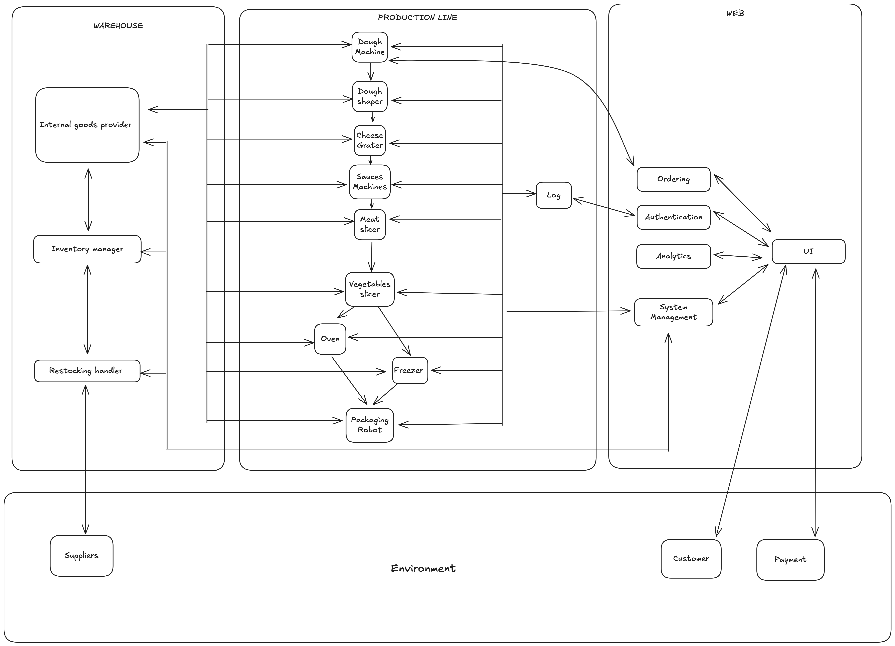
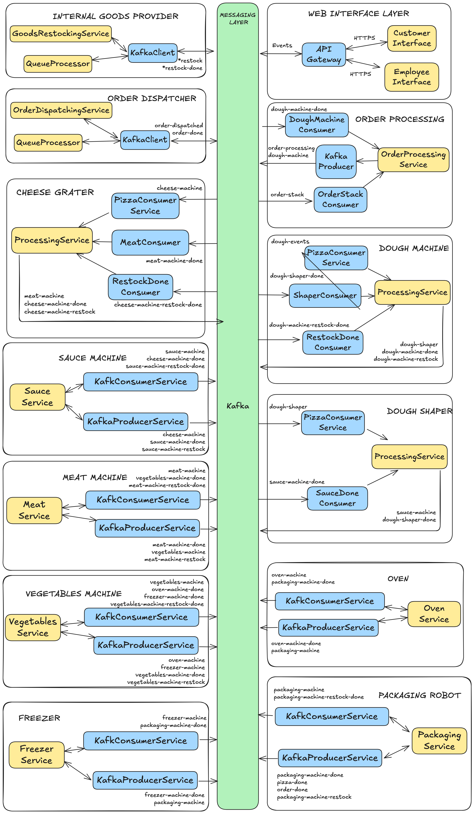

# Requirements and Traceability Matrix

## 1. Consolidated Functional Requirements

### Production Requirements

| ID | Requirement | Description | Priority | Measurable Criteria | Timing Constraint |
|----|------------|-------------|----------|-------------------|-------------------|
| **FR1** | Core Production Capability | System shall produce pizzas from raw ingredients through an automated production line | High | ≤100 pizzas/hour capacity | Event-chain - Input synchronisation constraint |
| **FR2** | Dough Preparation | System shall prepare and shape dough according to recipes | High | Complete within 5 minutes, Timer verification | Event-chain - Input synchronisation constraint |
| **FR3** | Sauce Application | System shall apply selected sauce type on prepared dough base | High | ±10ml accuracy, Volume measurement | Event related - Execution time constraint |
| **FR4** | Topping Application | System shall add toppings (cheese, vegetables, meats) per order specifications | High | Weight tolerance ±10g | Event related - Execution time constraint |
| **FR5** | Pizza Baking | System shall bake pizza at specified temperature and duration | High | 250-300°C, Temperature sensors | Event related - Execution time constraint |
| **FR6** | Freezing Capability | System shall optionally freeze pizza for preservation | Medium | -18°C, Temperature verification | Event related - Execution time constraint |
| **FR7** | Half-and-Half Mode | System shall support different toppings on each half of pizza | Medium | UI validation for split configuration | Event related - Arbitrary constraint |
| **FR8** | Multiple Sauce Types | System shall support a variety of sauce options (tomato, white, pesto, BBQ) | Medium | ≥4 sauce types available | Event related - Arbitrary constraint  |
| **FR9** | Calzone Production | System shall optionally fold and seal pizza into calzone format | Low | Fold completeness check | Event related - Arbitrary constraint |
| **FR10** | Packaging | System shall pack pizza in a box | High | Defect rate 5% | Event related - Periodic constraint |

### Web Interface Requirements

| ID | Requirement | Description | Priority | Measurable Criteria | Timing Constraint |
|----|------------|-------------|----------|-------------------|-------------------|
| **FR11** | Menu Selection | System shall display menu with predefined pizza options | High | ≥5 menu options | Event-chain - Reaction constraint |
| **FR12** | Full Customisation | System shall allow modification of ingredients, shape, size | High | ≥10 ingredient choices |  Event-chain - Reaction constraint |
| **FR13** | Quantity Selection | System shall allow ordering multiple pizzas in single transaction | High | Accept 1-100 pizza quantity | Event-chain - Input synchronisation constraint |
| **FR14** | Payment Processing | System shall process payments with multiple payment methods | High | Transaction success rate >99.9% | Event-chain - Input synchronisation constraint |
| **FR15** | Priority Queue | Custom orders shall receive production priority over standard orders | Medium | Queue metrics verification |  Event-chain - Reaction constraint |
| **FR16** | Order Tracking | System shall provide real-time status updates throughout production | High | Update latency <5 seconds | Event-chain - Output synchronisation constraint |

### Warehouse Requirements

| ID | Requirement | Description | Priority | Measurable Criteria | Timing Constraint |
|----|------------|-------------|----------|-------------------|-------------------|
| **FR17** | Inventory Storage | System shall store raw materials with proper conditions | High | Temperature/humidity monitoring | Event-chain - Reaction constraint |
| **FR18** | Inventory Monitoring | System shall track ingredient consumption and stock levels | High | Real-time accuracy ±1% | Event related - Periodic constraint |
| **FR19** | Automatic Restocking | System shall automatically reorder when inventory falls below thresholds | High | Trigger within 1 minute of threshold | Event related - Arbitrary constraint |

## 2. Non-Functional Requirements (Quality Attributes)

| ID | Quality Attribute | Requirement | Measurement | Priority |
|----|------------------|-------------|-------------|----------|
| **NFR1** | Availability | 99% uptime (7.2 hours downtime/month max) | Monitoring logs | High |
| **NFR2** | Performance | Process order in <100ms | Response time metrics | High |
| **NFR3** | Throughput | Handle at least 100 concurrent orders | Load testing results | High |
| **NFR4** | Modifiability | Add new topping/recipe in <2 hours | Time to deploy | Medium |
| **NFR5** | Scalability | Support 2x load increase without degradation | Stress testing | High |
| **NFR6** | Security | Protect user data and payment information | Penetration testing | High |
| **NFR7** | Usability | New user completes order in <3 minutes | User testing | Medium |
| **NFR8** | Reliability | <0.1% production failures | Error logs analysis | High |
| **NFR9** | Maintainability | MTTR (Mean Time To Repair) <30 minutes | Incident reports | Medium |
| **NFR10** | Interoperability | Support REST API integration | API testing | Medium |

## 3. Traceability Matrix

### Functional Requirements Traceability

| Req ID | Requirement | Priority | Feature Model Elements | Analysis Architecture | Design Components |
|--------|------------|----------|----------------------|---------------------|------------------|
| **FR1** | Core Production | High | Production (root) | Production Component | OrderProcessingController, All Machine Controllers |
| **FR2** | Dough Preparation | High | DoughCreator, DoughShaper | DoughCreator Component | DoughCreatorController, DoughCreatorService, DoughDispatchService, DoughShaperController, DoughShaperService |
| **FR3** | Sauce Application | High | SauceCreator | SauceCreator Component | SauceController, SauceService, SauceDispatchService |
| **FR4** | Topping Application | High | ToppingApplication, Cheese/Vegetables/Meats | Cheese Component, Vegetables Component, Meat Component | CheeseController, CheeseService, CheeseDispatchService, MeatController, MeatService, MeatDispatchService, VegetableController, VegetableService, VegetableDispatchService |
| **FR5** | Pizza Baking | High | Cooking, Oven | Oven Component | OvenController, OvenService, OvenDispatchService |
| **FR6** | Freezing | High | Cooking, Freezing | Freezer Component | FreezerController, FreezerService, FreezerispatchService |
| **FR7** | Half-and-Half | Medium | HalfAndHalfMode | ToppingApplication, Cheese/Vegetables/Meats | Cheese Component, Vegetables Component, Meat Component | CheeseController, CheeseService, CheeseDispatchService, MeatController, MeatService, MeatDispatchService, VegetableController, VegetableService, VegetableDispatchService |
| **FR8** | Multiple Sauces | Medium | MultipleSauces | SauceCreator Component | SauceService (sauce types) |
| **FR9** | Calzone Production | Low | Cooking, CalzoneFolding | Cooking Component | CookingService (fold mode) |
| **FR10** | Packaging | High | PostProduction | Packaging Component | PackagingController, PackagingService |
| **FR11** | Menu Selection | High | CustomerInterface, MenuSelection | UI Component | CustomerInterfaceSW (/menu endpoint) |
| **FR12** | Customisation | High | Customisation, IngredientSelection, ShapeSelection, SizeSelection | UI Component | CustomerInterfaceSW, OrderProcessingController |
| **FR13** | Quantity Selection | High | QuantitySelection | UI Component | CustomerInterfaceSW (validation) |
| **FR14** | Payment | High | Payment | UI Component | CustomerInterfaceSW, APIGatewaySW |
| **FR15** | Priority Queue | Medium | PriorityQueue | Ordering Component | OrderProcessingController (queue logic) |
| **FR16** | Order Tracking | High | OrderTracking | UI Component | CustomerInterfaceSW, KafkaBusSW (events) |
| **FR17** | Inventory Storage | High | InternalGoodsProvider, ProductionSupply | Warehouse subsystem, Internal Goods Provider | GoodsProviderController, GoodsProviderService |
| **FR18** | Inventory Monitoring | High | InventoryManagement, UsageTracking, StockMonitoring | Inventory Management Component | InventoryController, InventoryService |
| **FR19** | Auto Restocking | High | Restocking, AutomaticReordering, SupplierIntegration | Restocking Handler Component | RestockingController, RestockingService |

### Non-Functional Requirements Traceability

| Req ID | Quality Attribute | Analysis Realisation | Design Implementation | Architectural Tactics |
|--------|------------------|---------------------|----------------------|---------------------|
| **NFR1** | Availability (99%) | Redundant subsystems, KafkaBus reliability | Distributed controllers, Event replay capability | Redundancy, Failover |
| **NFR2** | Performance (<100ms) | Direct function calls, Optimised paths | Timing constraints per component, Async processing | Caching, Parallelism |
| **NFR3** | Throughput (100 concurrent) | Event-driven architecture, Parallel processing | Kafka topics, Horizontal scaling | Load balancing, Queuing |
| **NFR4** | Modifiability (<2hr) | Modular functions, Clear interfaces | Service-based design, Adapter pattern | Loose coupling, Abstraction |
| **NFR5** | Scalability (2x load) | Stateless functions, Message-based | Kafka partitioning, Container orchestration | Horizontal scaling |
| **NFR6** | Security | Gateway pattern, Isolated subsystems | APIGatewaySW security, HTTPS/TLS | Authentication, Encryption |
| **NFR7** | Usability (<3min) | Simple interface flow | CustomerInterfaceSW UX | Progressive disclosure |
| **NFR8** | Reliability (<0.1% fail) | Quality control loops, Monitoring | Error handling, Circuit breakers | Fault detection, Recovery |
| **NFR9** | Maintainability (MTTR <30min) | Clear subsystem boundaries | Event logging, Dashboard monitoring | Observability, Modularity |
| **NFR10** | Interoperability (REST) | API Gateway pattern | REST controllers, OpenAPI spec | Standard protocols |

## Diagrams

### Description of the feature model:

### Analysis level architecture:

**Component Types & Visual Distinctions:**
- Light Grey rectangles – Subsystems
- White ellipses – Abstract Functions
- Light yellow ellipses – Interaction Controllers
- Light green ellipses – Interfaces & Middleware
- Light blue rectangle – Environment

### Design level components:

