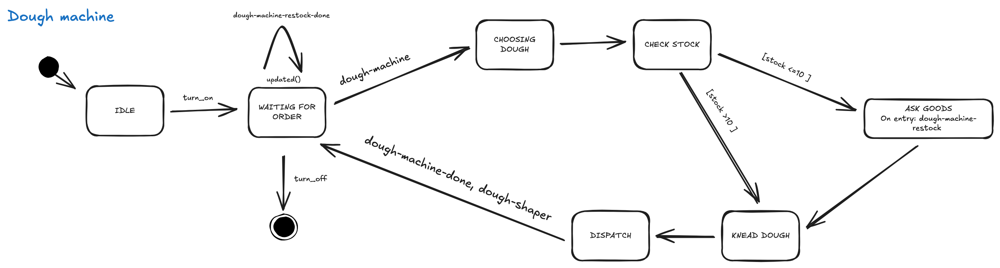
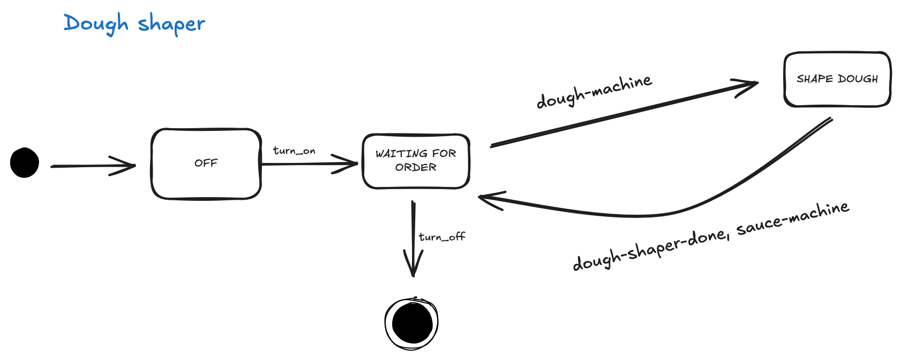
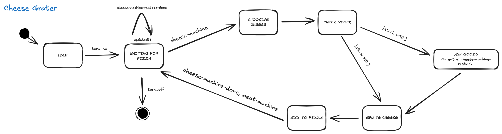
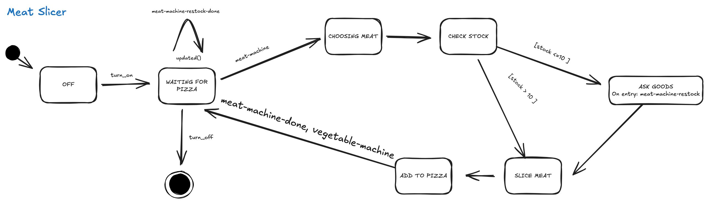
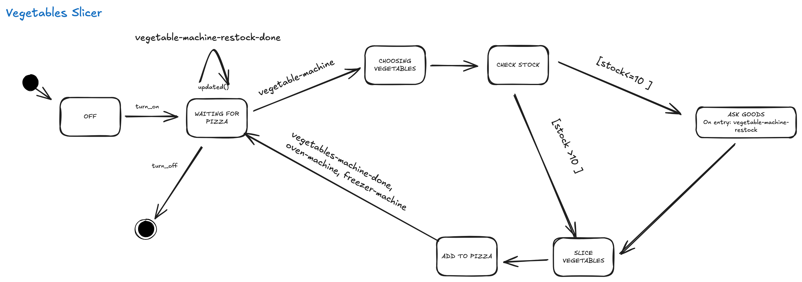
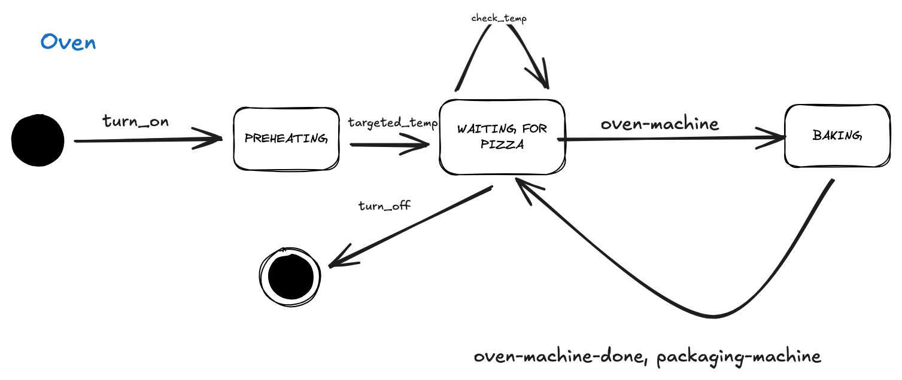
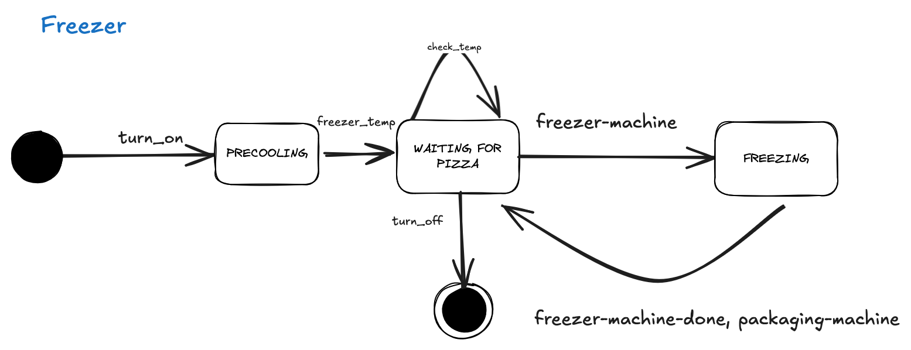
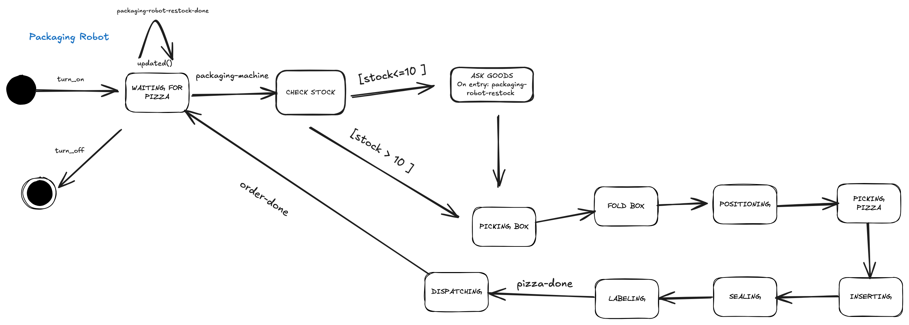

# State Machine Diagrams - Pizza Production Line

This document contains the detailed state machine diagrams for all production line components referenced in Section 6.1 of the report.

---

## Dough Machine

The Dough Machine kneads pizza dough after receiving an order. It follows the ingredient processing pattern: *WAITING FOR ORDER → CHOOSING DOUGH → CHECK STOCK → KNEAD DOUGH → DISPATCH*. When stock is sufficient ([stock > 10]), it proceeds to knead the dough; otherwise it requests restocking from the warehouse ([stock ≤ 10]). Upon completion, it signals dough-machine-done to the downstream component.

---

## Dough Shaper

The Dough Shaper receives raw dough from the Dough Machine and shapes it into pizza bases. The state machine demonstrates the simple workflow: *OFF → WAITING FOR ORDER → SHAPE DOUGH*, with a completion signal sent to downstream components (sauce-machine) upon finishing.

---

## Sauce Machine

The Sauce Machine applies sauce to shaped dough bases after receiving them from the Dough Shaper. It follows the ingredient processing pattern: *WAITING FOR PIZZA → CHOOSING SAUCE → CHECK STOCK → ADD TO PIZZA*. When stock is sufficient ([stock > 10]), it proceeds to sauce application; otherwise it requests restocking from the warehouse ([stock ≤ 10]). Upon completion, it signals sauce-machine-done to the next downstream component.

---

## Cheese Grater

The Cheese Grater adds grated cheese to pizzas after sauce application. It follows the ingredient processing pattern: *WAITING FOR PIZZA → CHOOSING CHEESE → CHECK STOCK → ADD TO PIZZA*. When stock is sufficient ([stock > 10]), it proceeds to cheese application; otherwise it requests restocking from the warehouse ([stock ≤ 10]). Upon completion, it signals cheese-machine-done to the next downstream component.

---

## Meat Slicer

The Meat Slicer adds sliced meat to pizzas after cheese application. It follows the ingredient processing pattern: *WAITING FOR PIZZA → CHOOSING MEAT → CHECK STOCK → ADD TO PIZZA*. When stock is sufficient ([stock > 10]), it proceeds to meat application; otherwise it requests restocking from the warehouse ([stock ≤ 10]). Upon completion, it signals meat-machine-done to the next downstream component.

---

## Vegetables Slicer

The Vegetables Slicer adds sliced vegetables to pizzas after meat application. It follows the ingredient processing pattern: *WAITING FOR PIZZA → CHOOSING VEGETABLES → CHECK STOCK → ADD TO PIZZA*. When stock is sufficient ([stock > 10]), it proceeds to vegetable application; otherwise it requests restocking from the warehouse ([stock ≤ 10]). Upon completion, it routes pizzas to either the oven or freezer based on configuration.

---

## Oven

The Oven implements temperature-controlled processing with a *PREHEATING* state to ensure the chamber reaches 100°C before accepting pizzas. It then follows the processing pattern: *WAITING FOR PIZZA → BAKING → completion signal* (oven-machine-done), with a feedback loop that allows the oven to process pizzas sequentially.

---

## Freezer

The Freezer follows a similar temperature-controlled pattern to the Oven, with a *PRECOOLING* state to reach -18°C. It then follows the processing pattern: *WAITING FOR PIZZA → FREEZING → completion signal* (freezing-machine-done), with a self-loop that enables continuous operation for frozen pizza variants.

---

## Packaging Robot

The Packaging Robot exhibits the most complex state machine with sequential packaging operations. After initialization and stock verification, it progresses through: *WAITING FOR PIZZA → CHECK STOCK ([stock ≤ 10] triggers restocking) → PICKING BOX → FOLD BOX → POSITIONING → PICKING PIZZA → INSERTING → SEALING → LABELING → DISPATCHING*. Upon completion, it signals pizza-done to the order dispatcher and returns to *WAITING FOR PIZZA* for the next order.

---

## Common Design Patterns

All state machines implement several consistent patterns:

1. **Initialization**: All machines begin in an *OFF* state and transition to operational states via turn_on signal
2. **Stock Management**: Ingredient-consuming machines include *CHECK STOCK* states with conditional transitions based on inventory levels
3. **Restocking**: Machines transition to *ASK GOODS* states and wait for warehouse confirmation (*updated()* or restock-done signals)
4. **Event-Driven Coordination**: Machines signal completion to downstream components using named events (e.g., sauce-machine-done, meat-machine-done)
5. **Shutdown**: All machines include turn_off transitions to final states for graceful system shutdown

These state machines were formalized as UPPAAL Timed Automata for formal verification, with added timing constraints, guards, and invariants to ensure real-time correctness.